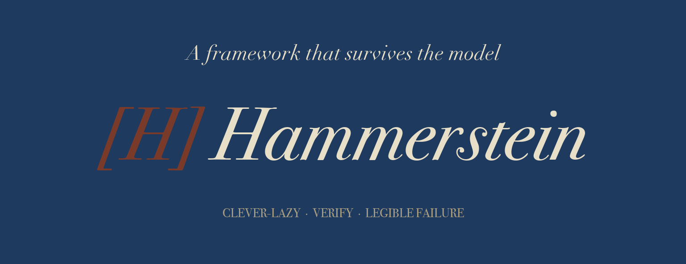

# Hammerstein



Hammerstein is a strategic-reasoning assistant tuned to the Hammerstein framework.
The load-bearing artifact is the framework encoded as a portable system prompt plus a small retrieved corpus.
This repo exists to make that reasoning style available even when the underlying model or provider changes.

> **Status:** v0 harness shipped. Reference corpus included. Provider fallback chain (OpenRouter → DeepSeek → Ollama) ships continuity by default.

## What this is

Hammerstein is a **focused strategic-reasoning model** — not a general-purpose
AI. It's tuned to think the way the Hammerstein framework prescribes:
clever-lazy over stupid-industrious, verification over enthusiasm, legible
failure over hidden success, "bring your own imagination" over generic
generation.

The project's load-bearing artifact is **the framework itself encoded as
portable system-prompt + RAG infrastructure** — so any underlying model
(Claude when affordable, paid Qwen on OpenRouter, local Llama/Qwen via
Ollama, future open-weight models) can reason in Hammerstein-style on demand.

## Example

*A typical strategic-reasoning consult — the framework ranks options, names what to deprioritize, and surfaces a counter-observation that could change the call.*

**Query**

It is Tuesday morning. I have 2 hours. Options: (a) draft the benchmark questions, (b) harden the RAG retrieval, (c) add more corpus entries, (d) run the harness end to end and record one baseline run. What should I do first?

**Response (abbreviated)**

This is clever-industrious work with an easy stupid-industrious trap: adding corpus before you can measure whether retrieval works.

1. Run (d) and record a baseline run. You need a working loop before you add more inputs.
2. Draft (a) as a short locked list. Five questions is enough to start.
3. Harden (b) only after the baseline tells you what broke.

Deprioritize (c) for now. More examples do not help if the harness cannot retrieve the right ones.

Counter-observation: if the baseline run already produces useful retrieval and the failure is prompt shape, skip retrieval hardening and spend the remaining time tightening the system prompt instead.

## What this is NOT

- **Not a Claude Code clone.** Code work continues to route through OpenRouter
  (paid Qwen Coder Plus / DeepSeek) or whatever Cursor IDE Auto provides.
  Hammerstein is for strategic thinking, not bulk code generation.
- **Not a from-scratch model.** Pre-training a foundation model is decisively
  out of scope. The realistic ceiling is fine-tuning a small open-weight
  model (Qwen 8B / Llama 3.1 8B-70B) — and that's only after the
  prompt-engineering + RAG path proves insufficient.
- **Not a daily-driver replacement** for Claude (yet). It's a fallback +
  business-continuity layer that becomes primary if Claude becomes
  unavailable or unaffordable.

## Why it exists

The portfolio survives an Anthropic outage / account ban / affordability
collapse for **code work** — cursor-agent CLI + OpenRouter Qwen + Gemini
CLI + Ollama already cover it. The gap is **strategic reasoning** — the
staff-officer / orchestrator role that interactive Claude currently fills.
No existing fallback matches it.

Hammerstein closes that gap. The framework is more important than the
model — once the framework is encoded portably, any underlying model can
fill the strategic-reasoning role.

## Customize the corpus

The corpus shipped here (`corpus/entries/`) is a **reference implementation**
— a small curated set of Hammerstein-style reasoning entries that
illustrate the framework's structure. It's not meant to be authoritative
for every operator.

**To make Hammerstein useful for your specific work:**

1. Clone this repo.
2. Read `research/HAMMERSTEIN-FRAMEWORK.md` for the framework synthesis.
3. Replace or augment `corpus/entries/` with reasoning examples drawn from
   your own work — incidents where you caught a stupid-industrious trap,
   structural fixes that compounded, verification-gates that paid off,
   counter-observations that reshaped a plan. The provenance + framing
   pattern (one principle per entry; tagged with quadrant + principle +
   source + quality) generalizes; the specific examples shouldn't.
4. Update `corpus/CORPUS-CURATION.md` to index your entries.
5. Optionally tune `prompts/SYSTEM-PROMPT.md` for your project's idiom.

The framework structure (system prompt + few-shot templates + retrieval
layer + provider fallback chain) transfers as-is. The corpus content is
yours to author.

## Quickstart

```bash
# Requires Python 3.11+
pip install -e .
export OPENROUTER_API_KEY="..."

hammerstein "What's the highest-leverage move for me this week given X, Y, Z?"
```

The harness reads `providers.yaml` for the fallback chain and routes through
OpenRouter (qwen3.6-plus) by default, with auto-fallover to DeepSeek and
Ollama if the primary fails. See `harness/README.md` for the full flag set
and `tests/test_continuity_chain.py` for the smoke-test harness.

## How the layers compose

| Layer | Where | What |
|---|---|---|
| Framework synthesis | `research/HAMMERSTEIN-FRAMEWORK.md` | Cross-source distillation of the framework's principles |
| Mechanical spec | `design/PILLARS.md` | Framework as mechanical pillars |
| Phased roadmap | `scope/PHASED-ROADMAP.md` | v0 / v1 / v2 trajectory |
| System prompt | `prompts/SYSTEM-PROMPT.md` | The identity-framing prompt every call carries |
| Templates | `prompts/templates/*.md` | Few-shot exemplars for 5 query shapes |
| Corpus | `corpus/entries/*.md` | Retrieved examples — your own to curate |
| Stack | `tech/STACK-DECISION.md` | Provider + model decisions, fallback chain rationale |
| Harness | `harness/`, `hammerstein_cli/` | The Python CLI that ties it together |
| Eval | `eval/`, `tests/` | Benchmarks + continuity smoke tests |

## License

[MIT](LICENSE)

---

*Hammerstein-Equord, Kurt Freiherr von (1878-1943). Chief of the German Army
Command 1930-1934. Surfaced the officer typology — clever-lazy / clever-
industrious / stupid-lazy / stupid-industrious — that anchors this project's
namesake framework.*
