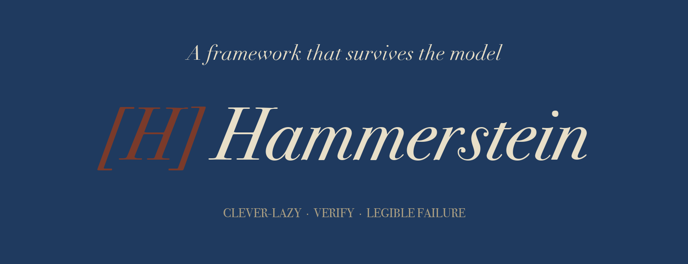

# Hammerstein



[](LICENSE)
[](https://www.python.org/downloads/)
[](https://github.com/lerugray/hammerstein/releases)

## In plain English

Most AI assistants are eager to please. They agree with you and tell you your plan is great. Hammerstein is a method for getting the opposite: an AI that pushes back. It refuses plans that are wasteful or dishonest, points out the weak spots in an idea, and when it says no it tells you what would turn that no into a yes. The goal is an assistant that helps you think, not one that flatters you. It works the same way whichever AI is running underneath.

## What this repo is

This repo is the **open-source framework and CLI**: the Hammerstein reasoning
discipline encoded as a portable system prompt, a set of few-shot templates, a
small retrieved corpus, and a Python harness that routes them to whichever model
you have. Point it at a frontier API, a cheap per-token endpoint, or a local
Ollama model. The reasoning style stays the same.

The load-bearing artifact is the framework, not the model. That is the whole
design goal: when the underlying model or provider changes, the reasoning
survives.

**Hammerstein is three separate things. This repo is only the first.**

| | What it is | Where it lives |
|---|---|---|
| **Framework + CLI** | The portable prompt, templates, corpus, and harness. MIT licensed. | This repo |
| **Hammerstein-7B** | The framework distilled into local open weights. | Separate project |
| **hammerstein.ai** | A hosted product built on the same discipline. | [hammerstein.ai](https://hammerstein.ai) |

They share a name and a doctrine. They do not share a codebase, and a claim
measured on one does not transfer to the others.

**Current release: v2.0** (2026-07-26). The plain-English summary layer is gone
from all six templates, which is a breaking change for anything that parsed it.
Full history in [CHANGELOG.md](CHANGELOG.md).

## What it is tuned for

Hammerstein reasons the way the framework prescribes: clever-lazy over
stupid-industrious, verification over enthusiasm, legible failure over hidden
success, "bring your own imagination" over generic generation.

Refusal is a feature. When the framework declines a plan it names the specific
condition that would change the answer, so a no is actionable rather than a dead
end. A wrapper that never refuses is not grading anything.

## Quickstart

```bash
# Requires Python 3.11+
pip install hammerstein     # from PyPI
# or: pip install -e .      # from a local clone, for development
export OPENROUTER_API_KEY="..."

# Quick-fire verb wrappers (recommended for daily use; scripts/h or scripts/h.ps1)
h next "what's the highest-leverage move this week given X, Y, Z?"
h audit "<plan>"        # adversarial pre-flight on a plan before firing it
h scope "<idea>"        # scope-pass on a half-formed idea
h worth "<proposal>"    # cost-benefit before committing
h sharper "<position>"  # counter-frame on a position you've already taken

# Or invoke the underlying CLI directly
hammerstein --template what-should-we-do-next "<query>"

# Or drop into an interactive shell with bounded rolling context (3 turns)
hsh
```

The harness reads `providers.yaml` for the fallback chain and routes through
OpenRouter (qwen3.6-plus) by default, falling over to a secondary OpenRouter
model, then DeepSeek, then local Ollama if the primary fails. See
`harness/README.md` for the full flag set and `tests/test_continuity_chain.py`
for the smoke-test harness.

**Optional:** `scripts/hquery` (fzf corpus search), `scripts/hlog` (call
history), and `scripts/hstats` (usage stats) round out the terminal-native
workflow. See § Companion shell utilities.

## Example

*A typical strategic-reasoning consult. The framework ranks options, names what
to deprioritize, and surfaces a counter-observation that could change the call.*

**Query**

It is Tuesday morning. I have 2 hours. Options: (a) draft the benchmark questions, (b) harden the RAG retrieval, (c) add more corpus entries, (d) run the harness end to end and record one baseline run. What should I do first?

**Response (abbreviated)**

Run a single end-to-end test with what you already have first. That is the only way to know what's actually broken. Drafting more questions or adding more corpus entries before that is guesswork. Five questions is enough to start; tighten the retrieval layer only after the test tells you what failed.

---

This is clever-industrious work with an easy stupid-industrious trap: adding corpus before you can measure whether retrieval works.

1. Run (d) and record a baseline run. You need a working loop before you add more inputs.
2. Draft (a) as a short locked list. Five questions is enough to start.
3. Harden (b) only after the baseline tells you what broke.

Deprioritize (c) for now. More examples do not help if the harness cannot retrieve the right ones.

Counter-observation: if the baseline run already produces useful retrieval and the failure is prompt shape, skip retrieval hardening and spend the remaining time tightening the system prompt instead.

## Benchmark: does the framework actually help?

**It depends on the model, and we measured where it stops.** The lift tracks
whatever judgment the base model lacks. On weaker models it is large. On the
strongest current model it inverts.

Published results and methodology: [hammerstein.ai/benchmark](https://hammerstein.ai/benchmark).

### The 2026-07 picture

| Model class | Raw preferred | Wrapped preferred | Reading |
|---|---|---|---|
| Frontier (Claude Opus 5, n=18) | 12 | 6 | Wrap adds conformance and shorter output, not usefulness |
| Commodity (4 models, n=216) | 3 | 182 | 31 ties. Lift survives the strict cut |
| Local/small (3 models, n=54) | 4 | 50 | Largest measured lift |

Counts are usefulness-plus-voice preferences from a blind pairwise panel of
cross-vendor judges. Use the wrap on frontier models when you want structured,
auditable output and shorter replies. Use it on local or cheap models when the
model would otherwise skip steps or drift. The framework does not repair weak
reasoning. It enforces a checklist the model cannot skip.

Full results: `eval/RESULTS-opus5-2026-07.md`,
`eval/RESULTS-cheap-arms-2026-07.md`, `eval/RESULTS-lowcap-2026-07.md`.

### The 2026-05 frontier result

On the frontier panel as it stood in May 2026 (Claude Opus 4.7, Claude Sonnet
4.6, GPT-5), blind LLM judges preferred the wrapped arm on **53 of 54 paired
ratings**, a 98.1% win rate.

6 questions (Q1 through Q6 from `eval/BENCHMARK-v0.md`) × 3 model families ×
{raw, wrapped} = 36 responses, then blind head-to-head judging,
position-randomized, scored on framework-fidelity, usefulness, and voice-match
plus an overall preference.

| Family | n | Wrapped wins | Raw wins | Win-rate |
|---|---|---|---|---|
| Claude Opus 4.7 | 18 | 18 | 0 | 100% |
| Claude Sonnet 4.6 | 18 | 17 | 1 | 94.4% |
| GPT-5 | 18 | 18 | 0 | 100% |

The single raw pick was DeepSeek on Q2/Sonnet, one outlier across 54 ratings.

This claim is bound to those three models on that question set at that date. It
is not a claim about any current model, and the Opus 5 run above shows exactly
how it ages.

### Three caveats, stress-tested

**Did the corpus just match the questions?** We added 4 generic
strategic-reasoning questions built to fall outside any domain the corpus covers
(Q9 through Q12 in `eval/BENCHMARK-v0.1.md`). **48 of 48 ratings preferred the
wrapped arm**, unanimous across 4 judges and 3 families. The home-turf
hypothesis is falsified.

**Is it the prompt or the RAG corpus?** Two ablation cells on Sonnet 4.6:
`mode=no-corpus` and `mode=corpus-only`, judged blind against the full stack.

| Pair | n | Full wins | Ablated wins | Ties | Win-rate (full) |
|---|---|---|---|---|---|
| Full vs corpus-only | 24 | 19 | 3 | 2 | 83.3% |
| Full vs prompt-only | 24 | 11 | 11 | 2 | 50.0% |

On Sonnet the system prompt carries the weight and the corpus is decorative.
**That finding does not generalize.** Extending the ablation to Opus 4.7 and
GPT-5 (v0.2) found all three configurations statistically tied on Opus, and
corpus-only actually beating the full stack on GPT-5. Which component delivers
the lift is model-dependent. Table in `eval/RESULTS-v0.1.md` § "v0.2 update".

**Are the judges biased toward their own outputs?** We added DeepSeek as a
fourth vendor judge. It agreed on 17 of 18 v0 ratings and 12 of 12 on the
out-of-domain set. The result is not a single-vendor artifact.

### Two confound checks

**Length bias.** Wrapped GPT-5 output ran 1258 characters *shorter* than raw and
still won every GPT-5 rating. Length does not explain the result.

**Framework-fidelity tautology.** That rubric axis is rigged: the system prompt
elicits Hammerstein vocabulary, and judges score "uses Hammerstein vocabulary"
highly. Recomputed on usefulness and voice alone, v0 lands at 96.3% and the
out-of-domain set at 97.9%. The headline does not rest on the rigged axis.

### Limits we have not closed

- **Every judge is an LLM**, trained on overlapping web distributions. A
  lay-person rater pilot is still outstanding.
- **Strategic reasoning is the home turf.** These runs say nothing about coding,
  math, or creative writing. The coder bench below covers code separately.
- **Total sample for the 2026-05 arc is 246 ratings** across four runs (v0, the
  out-of-domain set, the Sonnet ablation, and the Opus/GPT-5 ablation).
- **One generation per arm** on the 2026-07 runs, so no run-to-run variance was
  measured.

### Reproduce it or refute it

Runner: `eval/run_benchmark.py`. Judge: `eval/judge_pairs.py`. Question sets:
`eval/BENCHMARK-v0.md` and `eval/BENCHMARK-v0.1.md`. Write-up:
`eval/RESULTS-v0.1.md`. Transcripts and per-rating verdicts regenerate via
`python eval/run_benchmark.py && python eval/judge_pairs.py --run <subdir>`.
Cost across both runs was roughly $10 of OpenRouter credit and 90 minutes of
wall clock.

If you replicate on a different question set or judge panel and get materially
different results, [open an issue](https://github.com/lerugray/hammerstein/issues).
That is exactly the kind of pushback the framework wants.

### Hammerstein-CODER: the discipline, measured on code

The strategic benchmark says nothing about coding. The coder bench closes that
gap. Does wrapping a model in `prompts/SYSTEM-PROMPT-CODER.md` raise
over-engineering refusal without breaking legitimate implementation?

| Model | Plain (baits refused) | Hammerstein-CODER |
|---|---|---|
| Claude Opus 4.8 | 70% | 100% |
| Claude Sonnet 4.6 | 0% | 100% |
| GPT-5 | 0% | 100% |
| GLM-5.2 | 10% | 100% |
| Kimi-K2.7-Code | 0% | 90% |
| Qwen3-Coder-480B | 0% | 100% |

All six models pass the gate with the coder wrap. Bait-refusal climbs from near
zero to roughly 90-100%, while legitimate bounded implementation holds at 100%
for five of the six (Qwen3-Coder-480B at 80%). Correctness barely moves:
HumanEval pass@1 deltas on the three open coders are GLM +0.05, Kimi −0.03, and
Qwen 0.00, all inside measurement noise.

The model that already reasons this way (Opus 4.8, at 70% plain) shows the
smallest lift. That is what you would expect if the wrap grades judgment rather
than its own prompt.

Tested 2026-06-21/22. Restraint judged by an independent LLM judge
(kimi-k2.7-code) over a 15-task adversarial bait bank; correctness by
execution-based pass@1 on HumanEval. Full methodology in
`eval/RESULTS-coder-bench.md`.

Against ponytail, an off-the-shelf generic-minimalism prompt and a strong
baseline, both approaches refuse over-engineering at similar rates. Generic "do
less" covers that ground. The split shows up on vague requests: ponytail applies
the smallest possible change, while the coder wrap runs a scoping step first and
then implements. Measured at **+0.23 mean advantage on ambiguous-scope handling
across 6 models, and ≥+0.20 in 4 of 6**.

### The Fable-5 null result

We ran the framework on Fable 5, a model already trained to reason check-then-speak,
and got nothing: **12-11-0 (52.2%, n=23), mean Δ −0.22**. A blind,
position-randomized 4-judge panel found wrapped and raw statistically
indistinguishable.

We publish it because it is the cleanest evidence that the benchmark grades
judgment rather than its own vocabulary. The framework delivers a large lift on
models that lack the discipline and vanishes on models that already have it. The
coder bench repeats the pattern, and so does the Opus 5 crossover above. A
framework that hides its null results is itself stupid-industrious.

Verdicts: `eval/results/2026-06-11T195511Z/JUDGE-VERDICTS.md`. Harness:
`eval/judge_pass.py`.

## What this is NOT

- **Not a Claude Code replacement for editing code.** `hd` hands the actual file
  edits and git operations to [aider](https://aider.chat/). It is a wrapper, not
  a first-party code-editing tool.
- **Not a from-scratch model.** Pre-training a foundation model is out of scope.
  The realistic ceiling is fine-tuning a small open-weight model, and only if
  the prompt-plus-RAG path proves insufficient.
- **Not authoritative for your framework.** The shipped corpus is a reference
  implementation drawn from one operator's accumulated reasoning. The structure
  transfers as-is. The content is yours to author. See § Customize the corpus.

## Customize the corpus

The corpus in `corpus/entries/` is a **reference implementation**: a small
curated set of Hammerstein-style reasoning entries that illustrate the
framework's structure. It is not meant to be authoritative for anyone else.

To make Hammerstein useful for your own work:

1. Clone this repo.
2. Read `research/HAMMERSTEIN-FRAMEWORK.md` for the framework synthesis.
3. Replace or augment `corpus/entries/` with reasoning drawn from your own work:
   incidents where you caught a stupid-industrious trap, structural fixes that
   compounded, verification gates that paid off, counter-observations that
   reshaped a plan. The provenance and framing pattern generalizes (one
   principle per entry, tagged with quadrant, principle, source, and quality).
   The specific examples should not.
4. Update `corpus/CORPUS-CURATION.md` to index your entries.
5. Optionally tune `prompts/SYSTEM-PROMPT.md` for your project's idiom.

The framework structure transfers as-is: system prompt, few-shot templates,
retrieval layer, provider fallback chain. The corpus content is yours.

## `hsh`: the Hammerstein shell

For a conversational, stay-in-the-environment workflow, `hsh` drops you into an
interactive REPL with bounded prior-turn context. Type prose, get an audit, push
back with more prose, get a refined audit.

```
$ hsh
Hammerstein Shell (hsh) — interactive strategic-reasoning environment
Type :help for commands, :exit or Ctrl-D to quit.
Rolling context capped at 3 turns.

hsh:my-project> should I refactor the auth flow this week?
[runs audit-this-plan with full adversarial review streamed live]

hsh:my-project> what if the auth flow is downstream of a billing change?
[runs audit again, with prior turn injected as background context]

hsh:my-project> :d add a TODO comment to auth.py noting the dependency
[invokes `hd` for actual code work: full audit + aider dispatch]

hsh:my-project> !git status
[bash passthrough]

hsh:my-project> :exit
```

Design constraints, all load-bearing:

- **Every template call is a discrete fresh invocation.** No conversation
  history gets dumped into the few-shot template, and corpus retrieval runs
  fresh per turn.
- **Bounded prior-turn context (last 3 turns)** is injected as a prefix so
  iteration works ("apply the same fix to X", "given Y, retry"). The cap
  prevents the shell from quietly becoming a conversation host.
- **Plain prose runs `audit-this-plan`**, which is read-only thinking.
  Dispatching real file edits requires the explicit `:d` verb, so nothing
  mutates by accident.
- **Aider still owns conversation state, file edits, and git operations** when
  invoked via `:d`. The state-ownership boundary stays intact.
- **Project state file (`:state`).** If `.hammerstein-state.md` exists in the
  project root (found by walking up to the nearest `.git`, `pyproject.toml`,
  `package.json`, `Cargo.toml`, `go.mod`, `Gemfile`, or `requirements.txt`), its
  contents are injected as a preamble before the rolling context on every call.
  `:state` views it and `:state edit` opens it in `$EDITOR`, creating it if
  missing. Use it to persist project constraints across sessions without
  polluting the turn buffer.

Falsification gate: if `hsh` produces noticeably worse audits than
fresh-from-cold `hammerstein` calls, the bounded-context injection is corrupting
framework reasoning and should be killed in favour of verb-only mode. Compare
hsh output against a fresh audit on the same query.

## `hd`: Hammerstein dispatch

`hd` is a thin wrapper that takes operator prose, runs it through the
`audit-this-plan` pre-flight, and dispatches to [aider](https://aider.chat/) for
the file editing and git work. It makes Hammerstein viable as a daily-driver
substitute when your usual provider is unavailable or quota-constrained.

```bash
# Default: audit, confirm, dispatch via OpenRouter Qwen3.6-plus
hd "fix the typing-collision bug in cli.py"

# Skip the audit pre-flight for trivial tasks
hd --no-audit "rename foo to bar across these files"

# Force a specific provider
hd --provider claude "design pass on the auth flow"
hd --provider deepseek-chat "draft a README section about X"
hd --provider openrouter-coder "refactor the parser for readability"

# Show planned aider invocation without executing
hd --dry-run "..."

# List the routing table
hd --list-providers
```

State-ownership boundary, load-bearing: Hammerstein owns audit, scope, route,
and dispatch. Aider owns file editing, conversation state, tool-use loops, and
git. The wrapper does not track chat history, manage `.git`, or parse tool
calls. If it starts doing those, it has crossed into reinventing Claude Code.

Provider routing table:

| Provider           | Model                              | Auth                          | Executor      |
|--------------------|------------------------------------|-------------------------------|---------------|
| `openrouter`       | `openrouter/qwen/qwen3.6-plus`     | `OPENROUTER_API_KEY`          | aider         |
| `openrouter-coder` | `openrouter/qwen/qwen3-coder-plus` | `OPENROUTER_API_KEY`          | aider         |
| `deepseek`         | `deepseek/deepseek-chat`           | `DEEPSEEK_API_KEY`            | aider         |
| `claude`           | `claude-sonnet-4-6`                | `ANTHROPIC_API_KEY` (paid)    | aider         |
| `claude-opus`      | `claude-opus-4-7`                  | `ANTHROPIC_API_KEY` (paid)    | aider         |
| `claude-code`      | (Claude Code subscription)         | Pro/Max plan, no API key      | claude-code   |
| `cursor-agent`     | (Cursor subscription)              | Cursor login, no API key      | cursor-agent  |
| `ollama`           | `ollama/qwen3:8b`                  | (none, local)                 | aider         |

**Subscription-backed providers (`claude-code`, `cursor-agent`) bypass aider and
use the subscription's own tool-using agent.** The audit pre-flight still runs
through OpenRouter, which is cheap, so the expensive part of the dispatch lands
on a subscription you already pay for. Useful when you would rather burn
subscription rate limits than pay per token. The `--file`, `--read`, and
`--architect` flags do not apply to these executors, since the underlying agent
finds files through its own tool use. Mention file references in the prose
instead.

- `claude-code` requires the `claude` CLI on PATH (Pro/Max plan, no API key).
- `cursor-agent` requires the `cursor-agent` CLI on PATH and a one-time
  `cursor-agent login`.

Dispatch logs land at `~/.hammerstein/logs/dispatches.jsonl`, separate from the
audit-call log at `~/.hammerstein/logs/hammerstein-calls.jsonl`.

**Falsification gate, cleared 2026-05-05.** The original test was: if the
operator has not dispatched a real coding task through `hd` within 14 days, the
architecture is wrong. It cleared by self-build. The state-file injection
feature was implemented by `hd` dispatching to aider (public commit c875804,
about $1 of OpenRouter spend, a 6.5 minute run, 43 tests passing). The
substitute carried real architectural work, not just maintenance edits.

## Companion shell utilities

Four thin shell scripts surface template invocation, the corpus, the call log,
and usage stats. POSIX shell plus `fzf`, `bat`, and `jq`. No UI framework.

```bash
# Add scripts/ to PATH (or symlink h / hquery / hlog into ~/.local/bin/)
export PATH="$PATH:$(pwd)/scripts"

# h -- quick-fire template wrapper (verb shortcuts; falls through to classifier on bare query)
h audit "<plan>"          # -> --template audit-this-plan
h scope "<idea>"          # -> --template scope-this-idea
h worth "<proposal>"      # -> --template is-this-worth-doing
h next "<context>"        # -> --template what-should-we-do-next
h sharper "<position>"    # -> --template review-from-different-angle
h "<any query>"           # bare query, classifier auto-detects
# Default model: openrouter (paid, cheap). Override: HAMMERSTEIN_MODEL=ollama h ...

hquery                    # fuzzy-search corpus entries (fzf + bat preview)
hquery "framework"        # pre-populate the search field
hlog                      # last 20 calls, column-aligned
hlog 50                   # last N calls
hlog | grep audit         # filter by template / query substring
hstats                    # last 7 days usage stats (calls, cost, templates, hosts)
hstats --gate             # 7-day window + explicit Phase A -> Phase B verdict
hstats --by-host          # cross-machine usage breakdown
```

`h` is POSIX shell on Linux and Mac, `h.ps1` on Windows; both ship in `scripts/`.
`hquery` needs `fzf`. `bat` gives syntax-highlighted previews and falls back to
`cat`. `hlog` and `hstats` need `jq`. The call log lives at
`~/.hammerstein/logs/hammerstein-calls.jsonl`, created on first call. Each entry
stamps the host, so `hstats --by-host` works across machines if you sync the log.

## How the layers compose

| Layer | Where | What |
|---|---|---|
| Framework synthesis | `research/HAMMERSTEIN-FRAMEWORK.md` | Cross-source distillation of the framework's principles |
| Mechanical spec | `design/PILLARS.md` | Framework as mechanical pillars |
| Phased roadmap | `scope/PHASED-ROADMAP.md` | v0 / v1 / v2 trajectory |
| System prompt | `prompts/SYSTEM-PROMPT.md` | The identity-framing prompt every call carries |
| Templates | `prompts/templates/*.md` | Few-shot exemplars for 6 query shapes |
| Corpus | `corpus/entries/*.md` | Retrieved examples, yours to curate |
| Stack | `tech/STACK-DECISION.md` | Provider and model decisions, fallback chain rationale |
| Harness | `harness/`, `hammerstein_cli/` | The Python CLI that ties it together |
| Eval | `eval/`, `tests/` | Benchmarks and continuity smoke tests |

## Stable downstream interface

Tools that script Hammerstein depend on these surfaces staying stable across
versions:

- **Template names.** `audit-this-plan`, `scope-this-idea`,
  `is-this-worth-doing`, `what-should-we-do-next`,
  `review-from-different-angle`, invoked via `--template`.
- ~~Plain English summary section~~ **removed in v2.0 (breaking; see CHANGELOG).**
  Responses are now the unfiltered technical body from the first line. Callers
  that extracted the summary block should consume the body directly.
- **stdout carries the response body, stderr the diagnostics.** A `[backend=...]`
  metadata line at the head of stdout is parseable and carries provider, cost,
  and latency.
- **Exit code zero** on a returned response, **non-zero** on backend exhaustion
  or hard failure. Empty stdout when all backends fail soft.

Adding templates is non-breaking. Removing or renaming any of the five above is
a major-version bump and lands under `### Breaking` in the CHANGELOG.

## License

[MIT](LICENSE)

---

*Hammerstein-Equord, Kurt Freiherr von (1878-1943). Chief of the German Army
Command 1930-1934. Surfaced the officer typology (clever-lazy,
clever-industrious, stupid-lazy, stupid-industrious) that anchors this project's
namesake framework.*

```
====================++++++++++++++++++++++++++*+********+
==================+%%%%%%%%%#++++++++++++++++++++++*+++++
===============%%%%%%%%%%%%#%%###+#++++++++++++++++++++++
============#%%%%%%%%%%%%%%#***=+++#*++++++++++++++++++++
======++===%%%%%%%%%%%%%%#*##*+=:::::=+++++=+++++++++++++
==========%%%%%%%%##**++==:-:::.......:=++++=++++++++++++
=========%%%%%##%#####**=-::............+++++=+++++++++++
=========%%%%%%%%%%%##**+=-::..:.........+++++==+++++++++
========+%%%%%%%%%%###**++--::::.:::.....++++++++++++++++
=========%%%%%%%%%%%#%##***--::..::......=+++++=+++++++++
=========%%%%%%%%%%%%##+==++*--:-:-::...:=++++=++++=+=+++
=========%%%%%%%%%%%%%%###*++***+--=***+===++=+++++++++++
=========+%%%%%%%%%%%%%%%%:#+%%%*:.+#@+.#===+++++++=+++++
========%%%%%%%%%%%%%%@%%%.--#%%%=.:-=-:.-+++++++=+++++++
========%%%%%%%%%%%%%%%%%#+-=%%%%*.:.-:.::++=+++++==+++++
=======-%%%%%%%%%%%%#+=***+*#%%%%#-.::::::++++++++++=++++
========+%%%%%%%%%%%%%******#%@%%%+:::::::=++++++++++++++
=========#%%%%%%%%%%%%%%%##*#@%%%%*=::::::=++++++++++++++
++++======#%%%%%%%%%%%%%%#**%%%%%+-::::::=+++++++++++++++
++++++=+====@%%%%%%%%%%%%*%%*###+-:::-:::++=++=++++++++++
+++=++++===-@%%%@%@@%%@%%####@##+===-:*::++++++++++++++++
++++++=+===%%@%%@%@@@@@@%*=%#+===+=-::---++=+++++++++++++
++++++====#@%%@@@%@@@%@@@#%%%%%%*--::---+++++++++++++++++
++++++===%%%@@@@@@@@@@@@@%@@@%%#*=+---=++++++++++++++++++
++++==*%%%@@@@@@@@@@@@@@%@%%%%%###%#++-++++++++++++++***+
+++++%%%%%%%%@@@@@@@@@@@@@%%%%%%#+-%%%@%*++++++++++++*++*
++*%%%%%%%@%@@@@@@@@@@@@@@@@%*::..-**######++++++++******
#%%%%@=#%%%%%%%@%%@@@@*#@@%@-%%#**@**##*#####+++++*******
%#+=::-+*:+%%%%@%%@%%*+*#+#*==:+%%%%%**###*###**++*******
+-.#=::-.==@%%##%%%%@@@@@%#=+=*+=*@@%##*###*%%##+++******
+:+*::.%*+*#%%#####*#%@%@@@@%+*#-::@%*#***##%%####+******
=:*==*##*+++%%%#####***#@@@#%@@@%%%@@*##***##@###@*******
+=#****#*+++*%%#**###**#####%@@#%@#-#**##***###%#%##*****
*****++***+=+#%%*+####**##*#**%@#*@..*****@.-+*##@####***
#**+*+*++*++++%%%***####******%@@***#***#--:+*#%@%#%##%#*
%#***++*++**+**%%***####*******%@@*###*%.:+#**##%%#%%##%#
####**++++**+**#%#*+*#%#*******#%@@**#**@#####*#@%%%%%#%%
#***#**++=+%#**#%#***#%##*******%@@@#*****##%###%=#%%%#%@
##*****++++%%**%%#***#%%####***#*%@@@#***###%####-%%%##%@
```

> *"A clean rendering. The work lives in the gates, not the cover."*
> Hammerstein, on this portrait.
